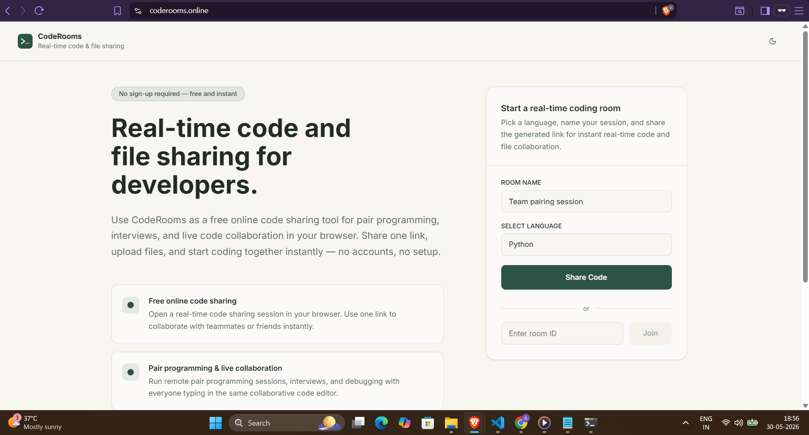
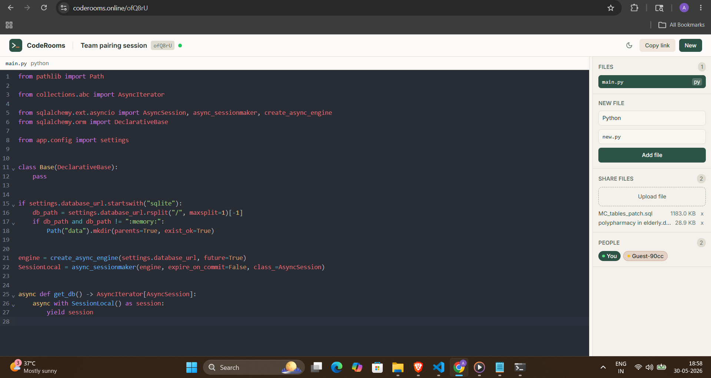

# 🚀 CodeRooms

### Real-Time Collaborative Code Editor & File Sharing Platform

CodeRooms is a browser-based collaborative workspace where developers can code together in real-time, share files instantly, and conduct technical interviews without requiring any signup or installation.

🌐 **Live Application:** https://coderooms.online

---

## 🎬 Live Demo

  

---

## ✨ Why CodeRooms?

Most collaborative coding tools focus only on code sharing.

CodeRooms combines:

✅ Real-time code collaboration

✅ Multi-user editing

✅ Multi-file support

✅ File sharing within the same room

✅ No login required

✅ Fast room creation

✅ Technical interview friendly

✅ Modern and intuitive UI

---

## 🔥 Features

### 📝 Real-Time Collaborative Editor

Collaborate with multiple developers inside the same editor simultaneously.

- Live code synchronization
- Cursor awareness
- Multi-user editing
- Low latency collaboration

Supports 10+ programming languages.

---

### 📂 File Sharing

Unlike many existing collaborative coding platforms, CodeRooms allows participants to share files directly inside the room.

- Upload multiple files
- Share project assets
- Exchange documents during interviews
- Centralized collaboration experience

---

### 👥 Technical Interviews

Built for coding interviews and pair programming sessions.

- Interviewer and candidate can edit together
- Real-time feedback
- No installation required
- Instant room sharing

---

### ⚡ Instant Collaboration

Create a room and start collaborating immediately.

No registration.

No onboarding.

Just share a link and start coding.

---

### 🎨 Modern UI/UX

Clean developer-focused interface designed for productivity.

- Dark editor theme
- Minimal distractions
- Smooth collaboration experience
- Responsive layout

---

## 📸 Screenshots

### Collaborative Workspace

  

---

### Live Collaboration & File Sharing

  

---

## 🏗️ Tech Stack

### Frontend

- React
- Monaco Editor
- JavaScript
- HTML/CSS

### Backend

- FastAPI
- WebSockets

### Real-Time Communication

- WebSocket-based synchronization
- Multi-user room architecture

### Database

- PostgreSQL

---

## ⚙️ How It Works

1. Create a room

2. Share the generated room link

3. Invite developers, students, or interview candidates

4. Collaborate in real-time

5. Share files alongside code

6. Build together instantly

---

## 💡 Use Cases

### Technical Interviews

Conduct coding interviews with real-time collaboration.

### Pair Programming

Work on problems together remotely.

### Student Projects

Collaborate on assignments and learning sessions.

### Team Collaboration

Share code and files across distributed teams.

### Coding Practice

Practice DSA and system design collaboratively.

---

## 🚀 What Makes CodeRooms Different?

| Feature | CodeRooms |
|----------|-----------|
| Real-Time Code Collaboration | ✅ |
| Multi-User Editing | ✅ |
| Multi-File Support | ✅ |
| File Sharing | ✅ |
| No Login Required | ✅ |
| Technical Interview Friendly | ✅ |
| Modern UI/UX | ✅ |

---

## 🌐 Try CodeRooms

Ready to collaborate?

👉 **https://coderooms.online**

Create a room.

Share one link.

Start coding together.

---

## ⭐ Support

If you like CodeRooms:

- Star this repository
- Share it with fellow developers
- Try the live application
- Provide feedback

Your support helps improve the platform.
